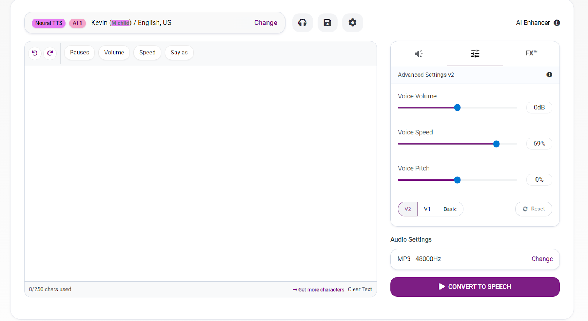

# Multilanguage Text-to-Speech (TTS)

## Intro Description
Multilanguage Text-to-Speech (TTS) technology converts written text into spoken language across various languages. It uses AI and machine learning to produce natural-sounding voices, making digital content more accessible. TTS supports people with visual impairments, aids language learners, and improves user interaction in apps and devices. With options for different voices and real-time adaptation, TTS offers a personalized, inclusive experience that bridges communication gaps across cultures and contexts.

---

## Sample Texts
**1.** *The air was cool and still, carrying the faint scent of pine and morning dew. Light filtered softly through the trees, painting gold across the forest floor. Somewhere nearby, a bird sang, its song drifting through the quiet like a gentle thought.*

**2.** *Text-to-speech, or TTS, is a technology that converts written text into spoken words. It allows computers, smartphones, and other devices to "read" text out loud using a synthetic voice. TTS is used in many everyday applications.*

---

## Scheme

---

## Screenshots of the Interface

<table>
    <tbody>
        <tr>
            <td></td>
            <td></td>
        </tr>
        <tr>
            <td></td>
            <td></td>
        </tr>
    </tbody>
</table>

---

## Examples and Screen Recordings

<table>
<tbody>
<tr>
<td>
<video src="https://github.com/user-attachments/assets/f8a88877-572d-4cc5-9877-3ff034d34217" controls preload>
Your browser does not support the video tag.
</video>
</td>
<td>

[▶️ Listen to audio 1](https://raw.githubusercontent.com/vanoe/Text-to-SpeechMultilanguage/master/audio/1.mp3)

</td>
</tr>
<tr>
<td>
<video src="" controls preload>
Your browser does not support the video tag.
</video>
</td>
<td>

[▶️ Listen to audio 2](https://raw.githubusercontent.com/vanoe/Text-to-SpeechMultilanguage/master/audio/2.mp3)

</td>
</tr>
<tr>
<td>
<video src="" controls preload>
Your browser does not support the video tag.
</video>
</td>
<td>

[▶️ Listen to audio 3](https://raw.githubusercontent.com/vanoe/Text-to-SpeechMultilanguage/master/audio/3.mp3)

</td>
</tr>
<tr>
<td>
<video src="" controls preload>
Your browser does not support the video tag.
</video>
</td>
<td>

[▶️ Listen to audio 4](https://raw.githubusercontent.com/vanoe/Text-to-SpeechMultilanguage/master/audio/4.mp3)

</td>
</tr>
<tr>
<td>
<video src="" controls preload>
Your browser does not support the video tag.
</video>
</td>
<td>

[▶️ Listen to audio 5](https://raw.githubusercontent.com/vanoe/Text-to-SpeechMultilanguage/master/audio/5.mp3)

</td>
</tr>
</tbody>
</table>

---

## Full Long Description

### Overview
Multilanguage Text-to-Speech (TTS) technology enables the conversion of written text into spoken language across various linguistic contexts. TTS systems support multiple languages, incorporating language-specific models and phonetic algorithms for accurate pronunciation. Neural network-based approaches enhance naturalness, and users can often choose from diverse voices within each language. Real-time adaptation and challenges related to linguistic diversity are integral aspects of advancing multilanguage TTS technology.

---

### Problem
- **Accessibility:** Individuals with visual impairments face barriers to accessing written content.
- **Language Learning:** Learners struggle with pronunciation accuracy and exposure to native speech nuances.
- **Linguistic Diversity:** Traditional TTS struggles with prosody, phonetic accuracy, and naturalness across multiple languages.

---

### Solution
- **Advanced Linguistic Models:** Neural networks capture phonetics and prosody for natural synthesis.
- **Adaptive Machine Learning:** Algorithms evolve through exposure to diverse datasets, enhancing pronunciation accuracy.
- **Noise-Resilient & Inclusive Design:** Handles diverse languages, accents, and contexts for broad accessibility.

---

## Process

### 1. Preprocessing
- **Input Transformation:** Tokenization and phoneme encoding.
- **Text Normalization:** Removal of noise, standardization, and corrections.

### 2. Model Selection
- **Linguistic Modeling:** Seq2Seq, RNNs, or Transformer architectures.
- **Prosody Modeling:** DNNs or CNNs capturing pitch, duration, and rhythm.

### 3. Training & Validation
- Dataset splitting (train/validation).
- Feature extraction of phonetics and prosody.
- Iterative training with backpropagation.
- Validation with metrics like cross-entropy loss and mean squared error.

### 4. Evaluation Metrics
- **Objective:** Mel Cepstral Distortion (MCD), SNR, STOI.
- **Subjective:** Human listening tests, MOS (Mean Opinion Score).
- **Adaptive Learning:** Continuous refinement with user feedback.

---

## Achievements
1. **Enhanced Accessibility** for visually impaired users.
2. **Boosted Productivity** with hands-free information consumption.
3. **Cognitive Support** for conditions like dyslexia.
4. **Improved Automated Interactions** in assistants & IVR systems.
5. **Cross-Linguistic Communication** for global inclusivity.
6. **Content Creation Support** for proofreading & narration.
7. **Adaptive Learning** ensures continual improvements.
8. **Natural Speech Advances** through neural prosody modeling.
9. **Real-World Integration** in healthcare, education, and entertainment.

---

## Future Enhancements
1. **More Natural Speech:** Rich intonation and emotional depth.
2. **Personalized Voice Models:** Tailored user-specific voices.
3. **Multimodal Integration:** Speech + gestures + visuals for VR/AR.
4. **Real-time Adaptive Learning:** On-device personalization.
5. **Improved Multilingual Proficiency:** Handling accents and dialects seamlessly.
6. **Ethical Safeguards:** Prevent misuse in deepfake or synthetic content.

---

## References
1. *Recent Advances in Deep Learning for Speech Synthesis: Real-time and High-quality Generative Models* – Yi Yang, Liang Lu, Steve Renals.
2. *Multilingual Text-to-Speech Synthesis with Tacotron* – Jan Kastner, Lukas Burget.
3. *Voice Cloning and Multilingual TTS with Tacotron 2* – Sheng Zhao, Kangcheng Lin, et al.
4. *FastSpeech: Fast, Robust and Controllable Text to Speech* – Yi Ren, Yangjun Ruan, Xu Tan, Tao Qin, Sheng Zhao, Zhou Zhao.

---
